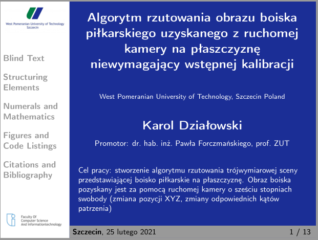
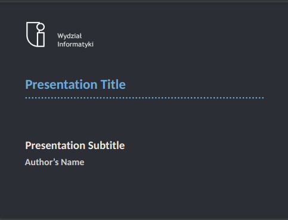
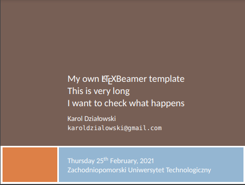
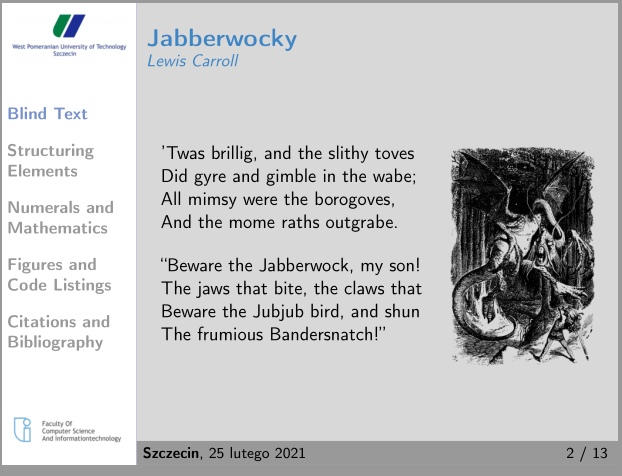
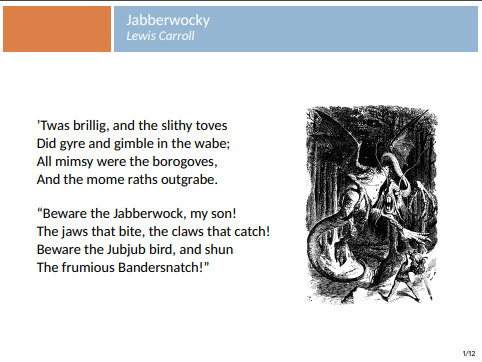
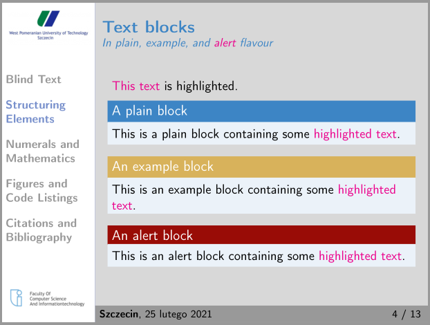
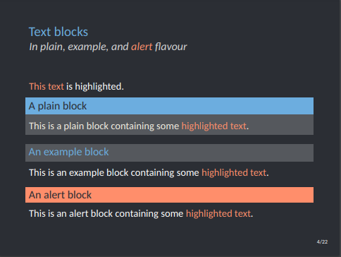
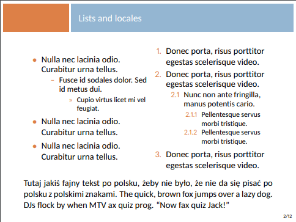

    

***

<h4 align="center">ZUT fibeamer template</h4>

  <a href="#about">About</a> •
  <a href="#how-to-use">How to use</a> •
  <a href="#my-other-templates">My other templates</a>

## About

This LaTeX beamer theme was based on fibeamer theme [Witiko/fibeamer](https://github.com/Witiko/fibeamer) from Masaryk University (Brno, Czech Republic). Theme created to be used on ZUT Faculty of Computer Science and Information Technology. 

If you found any bugs please report them on [karlosos/zut-fibeamer](https://github.com/karlosos/zut-fibeamer/)

PDF preview of this theme can be downloaded [here](https://github.com/karlosos/zut-fibeamer/releases/download/1.0/zut_fibeamer.pdf).

### How to use

Compile it locally with `pdflatex` or open it on Overleaf. Edit contents of the presentation in `zutfibeamer.tex`.

You can also [open this template on Overleaf](https://www.overleaf.com/latex/templates/zut-fibeamer/ksnwzmnhktvn). 

## My other templates

| [ZUTBeamer](https://github.com/karlosos/ZUTBeamer) | [ZUTfibeamer](https://github.com/karlosos/zut-fibeamer) | [Scratch](https://github.com/karlosos/beamer-template-scratch) | 
| ------ | -------- | -------- | 
|  |  | 
|  |  | 
|  |  | 
